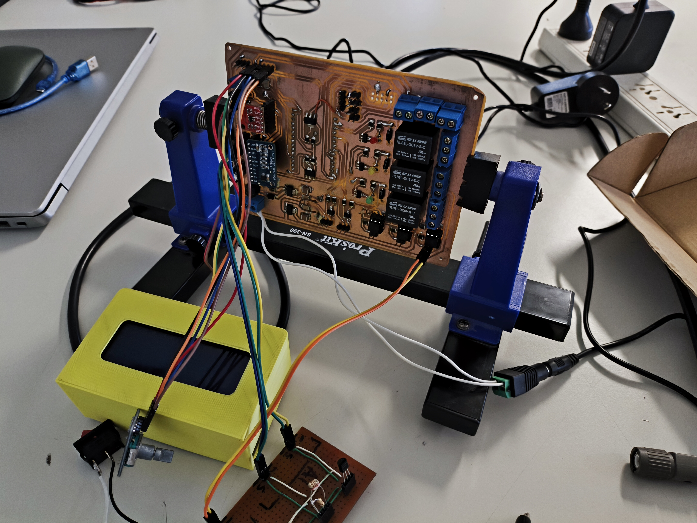
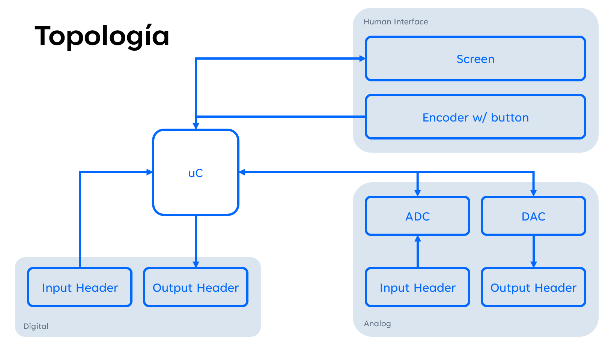
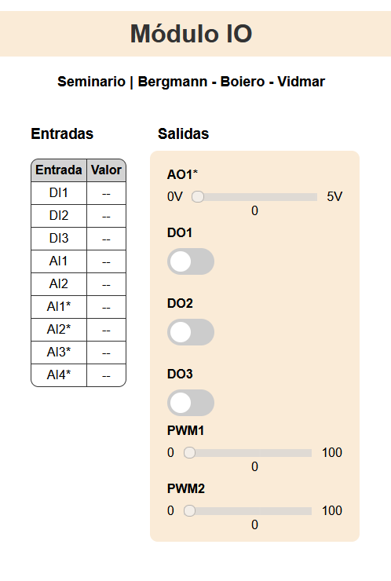
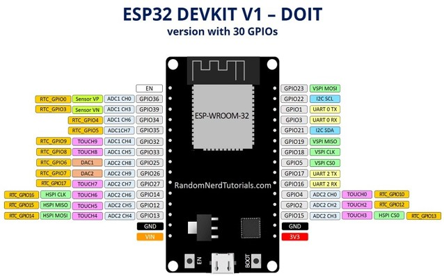
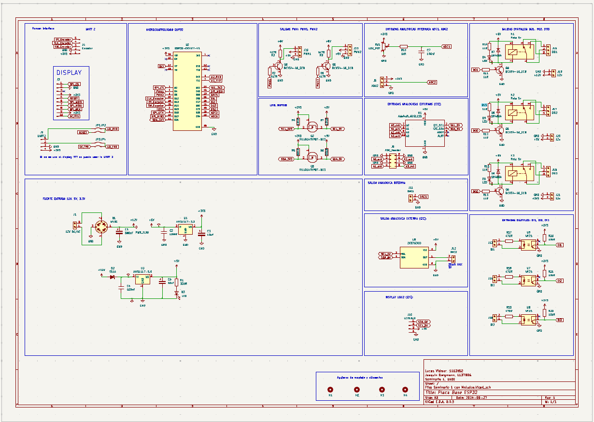
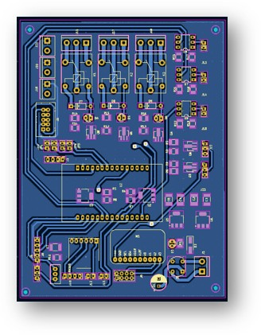
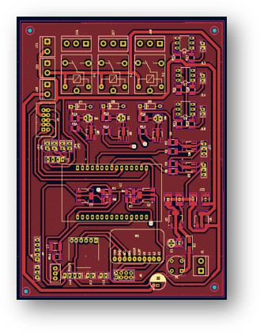
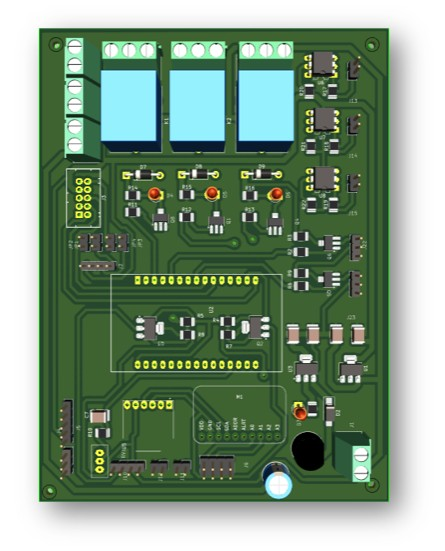

# Módulo Input / Output (I/O) para entornos educativos

> **Autores:**
> - [Lucas Vidmar](https://github.com/lucas-vidmar)
> - [Joaquín Bergmann](https://github.com/boierito)
> - [Lucas Boiero](https://github.com/JoacoBerg)
>
> **Institución:**
> - [Universidad Argentina de la Empresa (UADE)](https://www.uade.edu.ar/)

## Descripción

Este proyecto consiste en un módulo de entrada/salida (I/O) para entornos educativos, que permite a los estudiantes interactuar con sensores y actuadores a través de una interfaz gráfica de usuario (GUI) en un navegador web. El módulo I/O se comunica con el microcontrolador a través de una interfaz I2C, y proporciona una API RESTful para controlar los pines GPIO, los convertidores analógico-digital (ADC) y digital-analógico (DAC), y los codificadores rotatorios.

## Diseño de hardware

### Pinout

| Label | GPIO | Input/Output | Pines utilizados | Modo  |
|-------|------|--------------|------------------|-------|
| D2    | 2    | I/O          | Pantalla         | CS    |
| D4    | 4    | I/O          | PWM              | PWM   |
| D5    | 5    | I/O          | PWM              | PWM   |
| D12   | 12   | I/O          | Encoder          | CLK   |
| D13   | 13   | I/O          | Encoder          | DT    |
| D14   | 14   | I/O          | Encoder          | SW    |
| D15   | 15   | I/O          | DO               | DO    |
| RX2   | 16   | I/O          | U2_RXD           | U2_RXD|
| TX2   | 17   | I/O          | U2_TXD           | U2_TXD|
| D18   | 18   | I/O          | Pantalla         | SCK   |
| D19   | 19   | I/O          | Pantalla         | MISO  |
| D21   | 21   | I/O          | I2C              | SDA   |
| D22   | 22   | I/O          | I2C              | SLC   |
| D23   | 23   | I/O          | Pantalla         | MOSI  |
| D26   | 26   | I/O          | DI               | DI    |
| D27   | 27   | I/O          | DI               | DI    |
| D32   | 32   | I/O          | DO               | DO    |
| D33   | 33   | I/O          | DO               | DO    |
| D34   | 34   | I            | ADC interno      | ADC   |
| D35   | 35   | I            | ADC interno      | ADC   |
| VP    | 36   | I            | DI               | DI    |

### [Esquemático](kicad/Modulo%20IO%20Seminario.kicad_sch)

### [PCB](kicad/Modulo%20IO%20Seminario.kicad_pcb)

## Documentación de código

### [main.h](include/main.h)
Este archivo contiene las declaraciones principales del proyecto, incluidas las declaraciones de funciones para los manejadores de HTML, la impresión de menús, la lógica FSM y el control de GPIO.

### [led.h](include/led.h)
Este archivo contiene la declaración de la clase `BuiltInLed`, que proporciona métodos para controlar el LED incorporado en un microcontrolador.

### [lcdsim.h](include/lcdsim.h)
Este archivo contiene la declaración de la clase `SimulatedLCD`, que simula una pantalla LCD para fines de prueba.

### [i2c.h](include/i2c.h)
Este archivo contiene la declaración de la clase `I2C`, que proporciona métodos para inicializar la interfaz I2C y realizar operaciones de lectura y escritura en el bus I2C.

### [gpio.h](include/gpio.h)
Este archivo contiene la declaración de la clase `GPIO` y sus clases derivadas `DigitalGPIO` y `AnalogGPIO`, que proporcionan métodos para configurar, leer y escribir en los pines GPIO.

### [encodersim.h](include/encodersim.h)
Este archivo contiene la declaración de la clase `SimulatedEncoder`, que simula un codificador para fines de prueba.

### [encoder.h](include/encoder.h)
Este archivo contiene la declaración de la clase `Encoder`, que proporciona métodos para interactuar con un codificador rotatorio.

### [dac.h](include/dac.h)
Este archivo contiene la declaración de la clase `DAC`, que proporciona métodos para inicializar y controlar un Convertidor Digital a Analógico (DAC) a través de I2C.

### [adc.h](include/adc.h)
Este archivo contiene la declaración de la clase `ADC`, que proporciona métodos para interactuar con un Convertidor Analógico a Digital (ADC) a través de I2C.